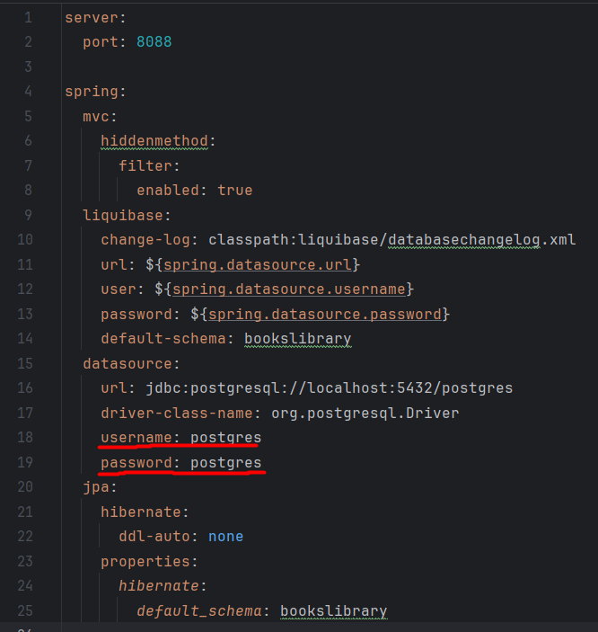

# Technologies


***
# Installation

```
git clone https://github.com/KripD0/BooksLibrary.git
```
***
# Getting started

A stopped postgresql is required to start the application. 
Before launching, it is necessary in the application.yaml set your username and password to connect to the database



To launch the application, port 8088 must not be busy, otherwise you need to change the port in appication.yaml
***